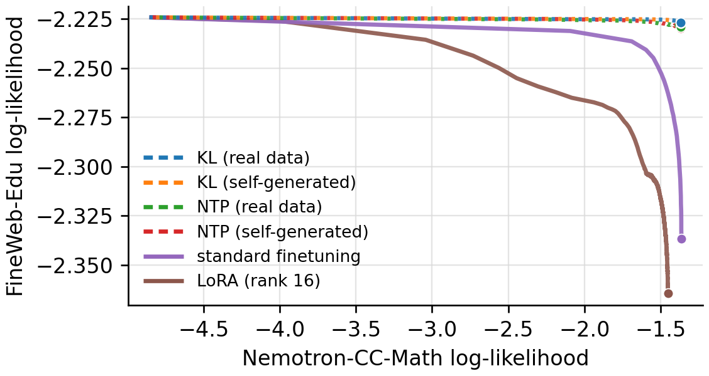
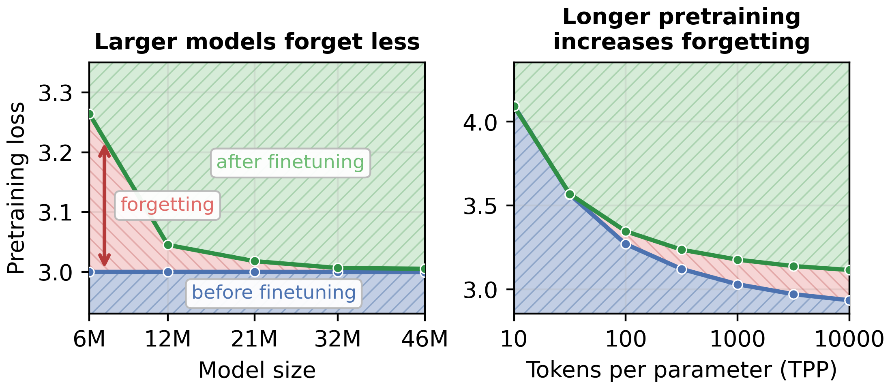
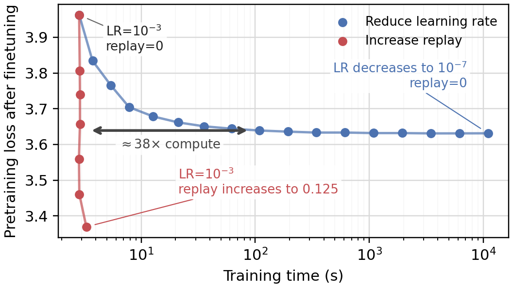

# Forgetting in Language Models: Capacity, Optimization, and Self-Generated Replay

Official repository for the paper *[Forgetting in Language Models: Capacity, Optimization, and Self-Generated Replay](https://arxiv.org/abs/2605.26097)*

[](https://arxiv.org/abs/2605.26097)

## Key results

Data replay greatly reduces forgetting during finetuning. When pretraining data is unavailable, self-generated samples from the model work nearly as well.



We find that forgetting nonetheless persists when the model has little remaining capacity: models pretrained close to saturation cannot absorb new information without overwriting prior knowledge.



Learning rate matters too. Low learning rates reduce forgetting but require substantially more training steps. Replay breaks this tradeoff, enabling fast, high-learning-rate finetuning
without forgetting.



## Installation

```bash
uv pip install jax optax wandb omegaconf tqdm numpy \
  datasets tokenizers transformers fire sentencepiece \
  matplotlib pandas scipy pyarrow
```

## Tutorial

The code expects each dataset to be a flat `uint16` token file. The first token of every training sequence is overwritten with a dataset id, so the filename stem must be listed in `DATASET_TOKEN_IDS` in `data/dataloader.py`. The built-in stems are:

- `c4_en` -> token id 0
- `c4_es` -> token id 1
- `fineweb_edu_10B` -> token id 0
- `nemotron_math_20M` -> token id 1

The following commands create a small English/Spanish C4 setup and run an end-to-end pretrain-then-finetune experiment. The token counts are intentionally small so the commands are easy to try; increase them for real experiments.

### 1. Train a tokenizer

```bash
ROOT=$PWD/data/example_c4
mkdir -p "$ROOT/tokenizer"

python data/tokenizer_train.py \
  --dataset=allenai/c4 \
  --subsets='["en", "es"]' \
  --n_words=1_000_000 \
  --vocab_size=4096 \
  --n_reserved_ids=10 \
  --out_dir="$ROOT/tokenizer"
```

This trains a byte-level BPE tokenizer with 10 reserved tokens and EOS. The trainer uses Hugging Face streaming datasets, so it does not download all of C4 up front.

### 2. Tokenize datasets

```bash
python data/tokenize_custom.py "$ROOT/c4_en.bin" \
  --dataset=allenai/c4 \
  --dataset_config=en \
  --split=train \
  --tokens=2_000_000 \
  --batch_docs=1024 \
  --shuffle=true \
  --tokenizer_dir="$ROOT/tokenizer"

python data/tokenize_custom.py "$ROOT/c4_es.bin" \
  --dataset=allenai/c4 \
  --dataset_config=es \
  --split=train \
  --tokens=2_000_000 \
  --batch_docs=1024 \
  --shuffle=true \
  --tokenizer_dir="$ROOT/tokenizer"
```

The resulting files are raw `uint16` memmaps. The trainer reshapes them into fixed-length sequences using `model.T`.

### 3. Pretrain on English C4

```bash
RUNS=$PWD/runs

python train_single.py \
  data.path="$ROOT/c4_en.bin" \
  data.num_tokens_valid=100_000 \
  model.save_dir="$RUNS/pretrain_en" \
  model.D=128 \
  model.L=4 \
  model.H=32 \
  model.T=128 \
  model.V=4096 \
  opt.batch_size=32 \
  opt.peak_lr=1e-3 \
  stop.num_tokens_train=1_000_000 \
  log.every_tokens=100_000 \
  log.mode=offline
```

Checkpoints are written to `model.save_dir/<wandb-run-id>/` and contain:

- `weights.npz`: model weights
- `config.yaml`: resolved training config

Set the checkpoint path for finetuning:

```bash
CKPT=$(find "$RUNS/pretrain_en" -mindepth 2 -name weights.npz -print -quit | xargs dirname)
echo "$CKPT"
```

### 4. Finetune on Spanish C4 with synthetic KL replay

```bash
python train_single.py \
  data.path="$ROOT/c4_es.bin" \
  data.num_tokens_valid=100_000 \
  model.load_path="$CKPT" \
  opt.batch_size=32 \
  opt.peak_lr=3e-4 \
  stop.num_tokens_train=500_000 \
  reg.method=kl_pre \
  reg.coeff=10 \
  reg.synth=true \
  reg.batch_size=16 \
  reg.buffer=8 \
  log.every_tokens=100_000 \
  log.mode=offline
```

When `model.load_path` is set, the trainer loads checkpoint weights and model dimensions from `config.yaml`. It also evaluates the loaded model's original dataset under the `prev_*` metrics, which is how the experiments measure forgetting.

`reg.method=kl_pre` adds a KL penalty between the finetuned model and the pretrained model on previous-distribution sequences. With `reg.synth=true`, those previous-distribution sequences are sampled from the loaded model instead of read from the original English token file. `reg.batch_size` controls the number of synthetic sequences per optimization step, and `reg.buffer` controls how many synthetic batches are generated at a time.

Useful variations:

- Remove the `reg.*` overrides to run ordinary finetuning on the downstream data.
- Set `reg.synth=false` to use real previous-distribution replay data from the loaded checkpoint config.
- Use `reg.method=ntp_pre` to train on previous-distribution replay with next-token loss instead of KL.
- Use `reg.method=replace` to replace a `reg.coeff` fraction of each downstream batch with previous-distribution examples.

Important metrics:

- `valid_ntp`: next-token loss on the current training distribution.
- `prev_ntp`: next-token loss on the checkpoint's original distribution.
- `valid_kl`: KL from the current model to the loaded model on current data.
- `prev_kl`: KL from the current model to the loaded model on previous data.

## Reproducing sweeps

The `experiments/` directory contains the sweep configs and plotting scripts used for the figures.

## Citation

```bibtex
@misc{marek2026forgetting,
  title={Forgetting in Language Models: Capacity, Optimization, and Self-Generated Replay},
  author={Martin Marek and Dongkyu Cho and Shikai Qiu and Rumi Chunara and Pavel Izmailov and Andrew Gordon Wilson},
  year={2026},
  eprint={2605.26097},
  archivePrefix={arXiv},
  primaryClass={cs.LG}
}
```
